# McKinsey Consultant Skill 完整工作流程

```mermaid
graph TB
    Start[用户输入商业问题] --> Step1[STEP 1: 定义问题边界]
    
    Step1 --> Step1_Output[输出: Is & Isn't 清单]
    Step1_Output --> Step1_Review{用户Review}
    Step1_Review -->|调整| Step1
    Step1_Review -->|确认| Step2
    
    Step2[STEP 2: 建立Issue Tree] --> Step2_Process[MECE原则拆解2-3层]
    Step2_Process --> Step2_Output[输出: 结构化问题树<br/>Lv1→Lv2→Lv3]
    Step2_Output --> Step2_Review{用户Review}
    Step2_Review -->|调整节点| Step2
    Step2_Review -->|确认| Step3
    
    Step3[STEP 3: 形成Hypotheses] --> Step3_Process[快速web_search<br/>5-10次搜索]
    Step3_Process --> Step3_Output[输出: Hypothesis Tree<br/>+ Storyline]
    Step3_Output --> Step3_Review{用户Review}
    Step3_Review -->|修改假设| Step3
    Step3_Review -->|确认| Step4
    
    Step4[STEP 4: 确定论证方式] --> Step4_Process[为每个假设选择:<br/>- 论证方式<br/>- 信息来源]
    Step4_Process --> Step4_Output[输出: 论证方案<br/>+ 数据需求清单]
    Step4_Output --> Step5
    
    Step5[STEP 5: 设计Dummy Pages] --> Step5_Process[为每个假设设计:<br/>- 页面布局<br/>- 图表类型<br/>- McKinsey规范]
    Step5_Process --> Step5_Output[输出: 完整Dummy Pages设计<br/>每页详细规格]
    Step5_Output --> Step5_Review{用户Review}
    Step5_Review -->|调整设计| Step5
    Step5_Review -->|确认| Step6
    
    Step6[STEP 6: 数据收集] --> Step6_Process[执行web_search<br/>15-30次搜索]
    Step6_Process --> Step6_Output[输出: 结构化数据集]
    Step6_Output --> Step7
    
    Step7[STEP 7: 生成PPT] --> Step7_Process[调用mckinsey-ppt-v4<br/>生成初版PPT]
    Step7_Process --> Step7_Output[输出: 初版PPT<br/>15-25页]
    Step7_Output --> Step8
    
    Step8[STEP 8: 迭代优化] --> Step8_User[用户查看PPT<br/>标注问题]
    Step8_User --> Step8_Fix{有问题?}
    Step8_Fix -->|是| Step8_Repair[Claude针对性修复:<br/>- 颜色对比度<br/>- 元素遮挡<br/>- 文字溢出<br/>- 内容拆分]
    Step8_Repair --> Step8_Output[输出: 优化版PPT]
    Step8_Output --> Step8_User
    Step8_Fix -->|否| Final
    
    Final[输出: 终极版McKinsey PPT] --> End[完成!]
    
    style Start fill:#C9F0FF
    style Final fill:#FFDB00
    style End fill:#90EE90
    style Step1 fill:#0065BD,color:#fff
    style Step2 fill:#0065BD,color:#fff
    style Step3 fill:#0065BD,color:#fff
    style Step4 fill:#002960,color:#fff
    style Step5 fill:#002960,color:#fff
    style Step6 fill:#002960,color:#fff
    style Step7 fill:#002960,color:#fff
    style Step8 fill:#002960,color:#fff
```



## 详细流程说明

### 🔵 PHASE 1: Hypotheses Tree (假设树)

#### STEP 1: 定义问题边界 ⏱️ 5分钟
**输入**: 用户的商业问题描述  
**过程**: 
- Claude提出澄清性问题
- 与用户对齐研究目标、范围、交付形式
**输出**: 
```markdown
## 问题定义
### 是 ✅
- [核心目标]
- [研究范围]
### 不是 ❌
- [排除内容]
```
**用户操作**: Review并确认或调整

---

#### STEP 2: 建立Issue Tree ⏱️ 8分钟
**输入**: 明确的问题定义  
**过程**:
- 基于业务逻辑用MECE原则拆解
- 自动生成2-3层问题树
**输出**:
```markdown
## Issue Tree
### Lv1: 顶层问题
  #### Lv2: 子问题1
    - Lv3: 子子问题1.1
    - Lv3: 子子问题1.2
  #### Lv2: 子问题2
```
**用户操作**: Review并调整节点(如需要)

---

#### STEP 3: 形成Hypotheses ⏱️ 12分钟
**输入**: Issue Tree  
**过程**:
1. 基于常识推理
2. 执行5-10次快速web_search获取框架
3. 为每个Issue形成假设
4. 组织成连贯storyline
**输出**:
```markdown
## Hypothesis Tree
**H1**: 核心假设1
  - H1.1: 支撑假设
  - H1.2: 支撑假设
**H2**: 核心假设2
### 需要验证的数据点
1. [数据点1]
2. [数据点2]
```
**用户操作**: Review并修改假设(如需要)

---

### 🔷 PHASE 2: Dummy Pages (页面设计)

#### STEP 4: 确定论证方式 ⏱️ 10分钟
**输入**: Hypothesis Tree  
**过程**:
- 为每个假设选择论证方式(模型/量表/框架/案例/可视化)
- 确定信息来源和搜索策略
**输出**:
```markdown
## 论证方案
### H1: [假设1]
#### 论证页面1
- 论证方式: 量表分析
- 信息来源: 行业报告 + 企业财报
- 关键数据点: [...] 
```

---

#### STEP 5: 设计Dummy Pages ⏱️ 15分钟
**输入**: 论证方案  
**过程**:
- 为每个论证页面设计McKinsey风格布局
- 确定图表类型、页面结构、McKinsey规范
- 列出精确的数据需求
**输出**:
```markdown
### 第X页: [McKinsey论点标题]
**页面布局**: 标题+单图表型
**图表类型**: 堆积柱状图
**数据需求**:
- X轴: [...]
- Y轴: [...]
- 系列: [...]
**McKinsey设计要点**:
- 配色: [...]
- 标注: [...]
- 洞察框: [...]
```
**用户操作**: Review设计(如需要)

---

### 🔶 PHASE 3: Data & Generation (数据与生成)

#### STEP 6: 数据收集 ⏱️ 20分钟
**输入**: Dummy Pages设计  
**过程**:
- 为每个Dummy Page执行2-5次web_search
- 总共15-30次搜索
- 多源验证关键数据
**输出**: 结构化数据集(JSON/表格形式)

---

#### STEP 7: 生成PPT ⏱️ 10分钟  
**输入**: Dummy Pages设计 + 数据集  
**过程**:
1. 调用mckinsey-ppt-v4 skill
2. 基于设计和数据生成每一页
3. 应用McKinsey设计规范
4. 执行质量检查
**输出**: 初版PPT (15-25页)

---

#### STEP 8: 迭代优化 ⏱️ 5-20分钟 (2-4轮)
**输入**: 初版PPT  
**过程**:
**Round 1**: 用户查看并标注问题
**Round 2**: Claude针对性修复
  - 颜色对比度问题
  - 元素遮挡问题
  - 文字溢出问题
**Round 3**: 用户re-check
**Round 4**: (如需要)内容拆分/细节打磨
**输出**: 终极版PPT ✨

---

## ⏰ 总耗时估算

| 阶段 | 时间 | 备注 |
|-----|------|------|
| STEP 1 | 5分钟 | 问题定义 |
| STEP 2 | 8分钟 | Issue Tree |
| STEP 3 | 12分钟 | Hypotheses (含快速搜索) |
| STEP 4 | 10分钟 | 论证方式 |
| STEP 5 | 15分钟 | Dummy Pages |
| STEP 6 | 20分钟 | 数据收集 (15-30次搜索) |
| STEP 7 | 10分钟 | PPT生成 |
| STEP 8 | 10-20分钟 | 迭代优化 (2-4轮) |
| **总计** | **90-110分钟** | **约1.5-2小时** |

---

## 🎯 关键成功因素

### 1️⃣ 问题定义要准确
- Is & Isn't必须清晰
- 避免范围过大或过小

### 2️⃣ Issue Tree要MECE
- 每一层不重不漏
- 2-3层优先,不要一开始就钻太深

### 3️⃣ 假设要可验证
- 假设不是猜测,要有逻辑支撑
- 必须知道什么数据能证明/证伪

### 4️⃣ Dummy Page要详细
- 页面布局要具体到图表类型
- 数据需求要精确到X轴/Y轴/系列

### 5️⃣ 数据要多源验证
- 关键数据至少2-3个来源
- 优先企业财报 > 权威机构 > 媒体

### 6️⃣ PPT要迭代优化
- 初版不求完美
- 2-3轮迭代达到终极版

---

## 🚨 常见问题避坑

### 问题1: Issue Tree拆解不MECE
**表现**: 
- 各分支有重叠
- 遗漏重要维度

**解决**:
- 使用标准拆解框架(市场=用户×渗透率×付费率×客单价)
- 每一层完成后检查是否MECE

---

### 问题2: 假设缺乏逻辑支撑
**表现**:
- 纯粹拍脑袋
- 找不到验证数据

**解决**:
- 快速web_search获取框架信息
- 基于常识+搜索形成假设

---

### 问题3: Dummy Page设计不够详细
**表现**:
- 只说"做个图表"但不知道什么图表
- 数据需求模糊

**解决**:
- 明确图表类型(柱状图/折线图/矩阵图)
- 列出X轴/Y轴/系列/标注的具体内容

---

### 问题4: 颜色对比度不足
**表现**:
- 深蓝背景+深蓝文字看不见

**解决**:
- **强制规则**: 深蓝背景必须白色文字
- 生成后自动检查并修复

---

### 问题5: 内容密度过高
**表现**:
- 单页挤了10+个要点
- 文字溢出

**解决**:
- 拆分为2-3页
- 精简文字,用要点代替长句

---

## 📚 最佳实践

### ✅ DO

1. **问题定义阶段多沟通** - 确保方向正确
2. **Issue Tree先做2层** - 不要一开始就拆太细
3. **假设基于快速搜索** - 不是闭门造车
4. **Dummy Page详细设计** - 为生成PPT打好基础
5. **数据多源验证** - 确保可靠性
6. **PPT多轮迭代** - 初版不求完美

### ❌ DON'T

1. **不要跳过问题定义** - 否则方向跑偏
2. **不要Issue Tree太深** - 容易迷失方向
3. **不要假设太多** - 聚焦3-5个核心假设
4. **不要Dummy Page太简略** - 否则生成质量差
5. **不要只搜索一次** - 数据要多源验证
6. **不要初版就追求完美** - 浪费时间

---

**准备好开始了吗?让我们用McKinsey consultant skill解决你的商业问题!** 🚀
